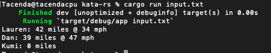
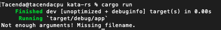

# kata-rs

This kata is implemented in rust lang. It should be cross-platform compatible. (Mac/Windows/Unix)
*Note* I have only tested this on Mac OS as I dont have access to a Windows machine at the moment.

I implemented a binary application that utilized a local library. This local library had its business logic separated out into models and services. The associated tests were then captured within that respective file. The architecture was presented in the rust programming book (https://doc.rust-lang.org/book/#the-rust-programming-language). I didn’t take the time to really test the filesystem aspect of this kata. I could code to an interface and have a mock object in order to test some behaviors in this application that aren’t currently tested. However, this being a coding kata, I figured I have demonstrated enough within this project to show knowledge of Rust and programming in general. This project is a single threaded application.

I tested this application with an input text file that had 10k lines, the program seemed just as fast as an input file with 6 lines and would need profiling tools to measure the millisecond difference. Obviously, there are some edge cases one could run into that haven’t been handled. However, most of the main ones have been handled.

## Setup Instructions
Make sure rust is installed on the host OS (https://www.rust-lang.org/tools/install)

## Run

Within a terminal/command. Run the command "cargo run [File Name]"

Example "cargo run input.txt"

## Tests

Make sure the setup instructions are taken care of.

In order to run tests within a terminal/command, run the command "cargo test --all"

## Demo

Success

Error

